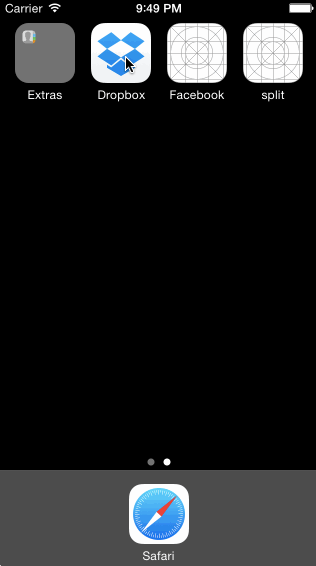

# Dropbox - Swift wireframe

A wireframe for Dropbox done in Swift.

Time spent: 2.5 hours spent in total

Completed user stories:

 * [x] Required: 3 welcome screens. 
 * [x] Required: Create User Form: Back button, Terms of Service page, Files / Photos / Favorites / Settings tab, logout. 
 * [x] Required: Sign In page: Back Button, "Forgot password?" prompt, Files / Photos / Favorites / Settings tab, logout.
 * [x] Optional: Swipe through the welcome screen. 
 
Notes:

Walkthrough of all user stories:

GIF created with [LiceCap](http://www.cockos.com/licecap/).
